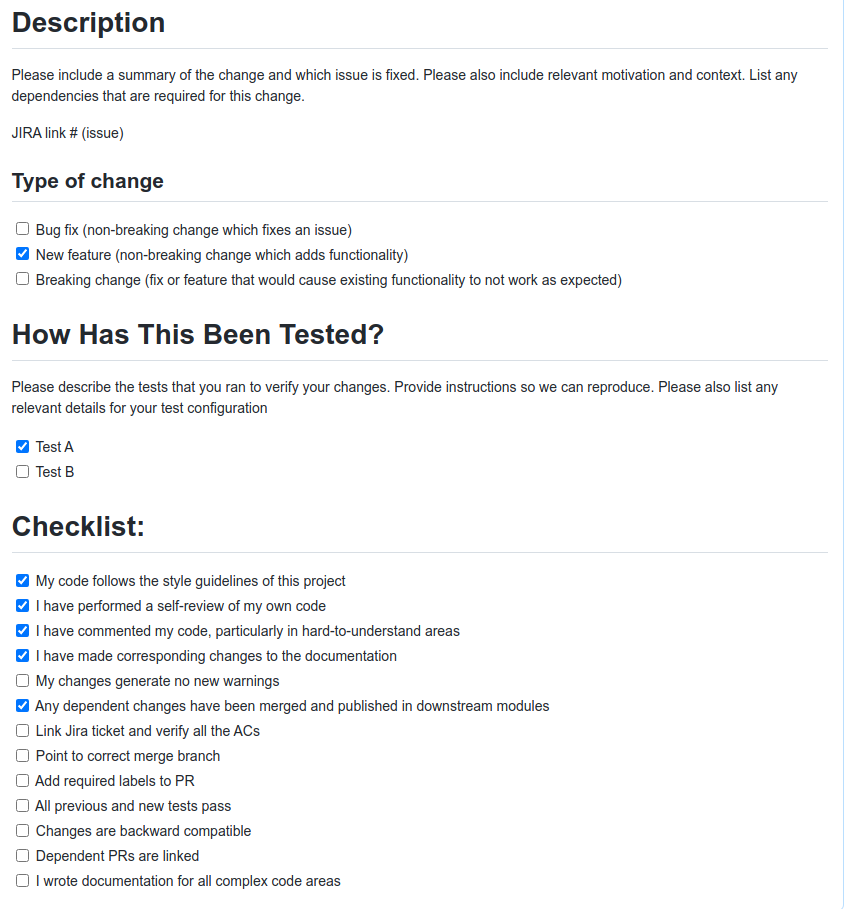

# Kotlin-RestAssured Test Automation

This is a sample API project for Rest Assured with Maven Kotlin DSL & JUnit 5

## Introduction
All the Test Cases kept in this repository. Developers can select the test cases which they need to execute during 
their build Pipeline(by adding a tag, eg: `pipeLine1`).

# Prerequisites
This requires [Java JDK](https://www.oracle.com/java/technologies/javase-downloads.html) v11 and Maven.

## Open the Project

You can open the project by any IDE (Select `pom.xml` file when opening the project)

In this project you can find two branches:
- Master - Contain up-to-date code
- Working - In progress development of the Test cases

## Set up the Project

You can set your project configurations in `config.yml`. Please make sure you DO NOT commit sensitive information in this file.
You can pass those data via your CI/CD tools during the execution.

## Continuous Integration/Continuous Deployment with Jenkins

Here I have used Jenkins as my CI/CD tool. You can edit `Jenkinsfile` based on your requirement.
How to create [Jenkinsfile](https://www.jenkins.io/doc/book/pipeline/jenkinsfile/).

## Running Test Suites

- Regression tests (excluding wip tests) - `mvn clean test -Pprofile=regressionTest`
- Developer PipeLine tests (excluding wip tests) - `mvn clean test -Pprofile=pipeLine1_Test`
- All test cases - `mvn clean install test`

Default test suite will be `regressionTest`.

## Adding custom test tasks

Custom test suits can be added in `pom.xml`. 
 
Current test suits are as follows.
  
- General Regression Test Task (excluding wip tests)  - regressionTest
- Developer PipeLine Test Task (excluding wip tests)  - pipeLine1_Test
- 
# Create Pull Request

When you crete a PR from the GitHub, you need to mark a checklist which related to your merge.

## Adding code owners

You can add code owners username to the `/.github/CODEOWNERS` file. So they will automatically get an email 
for any pull requests.

# References for learn Kotlin

* https://kotlinlang.org/docs/maven.html
* https://openclassrooms.com/en/courses/5774406-learn-kotlin/5931841-enhance-your-classes
* https://kotlinlang.org/docs/reference/classes.html
